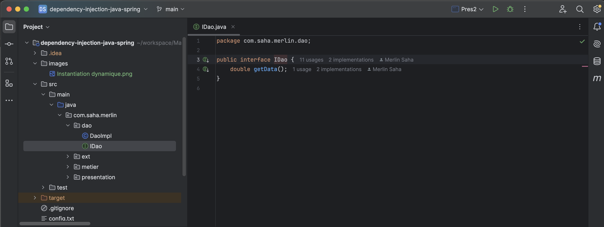
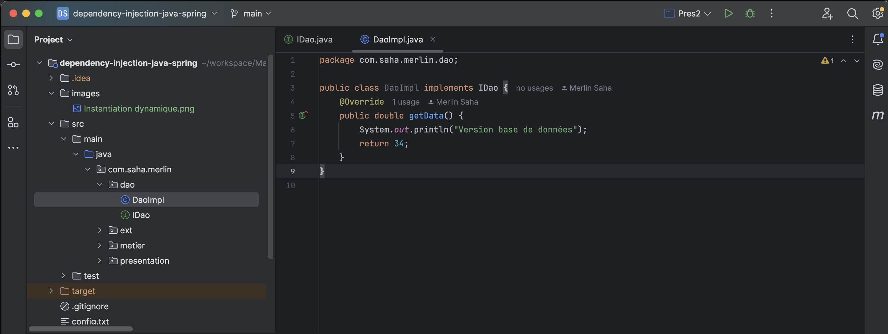
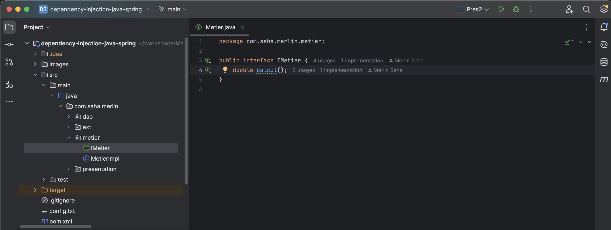
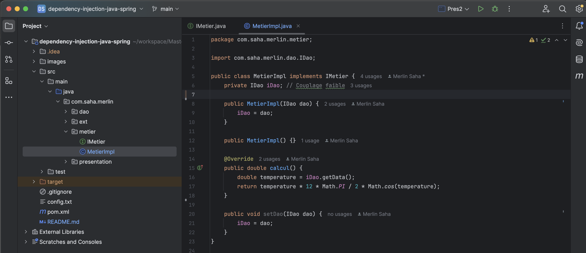

# 1. Créer l'interface IDao avec une méthode getData

# 2. Créer une implémentation de cette interface

# 3. Créer l'interface IMetier avec une méthode calcul

# 4. Créer une implémentation de cette interface en utilisant le couplage faible

# 5. Faire l'injection des dépendances :
   ## a. Par instanciation statique

   ## b. Par instanciation dynamique

   ## c. En utilisant le Framework Spring
   ### - Version XML

   #### - Base de données

   
   
   

   #### - V2 Capteurs

   

   ### - Version annotations
    
   #### - Version annotations Avec Contructeur
    
   

   #### - Version annotations Avec Autowired

   
    